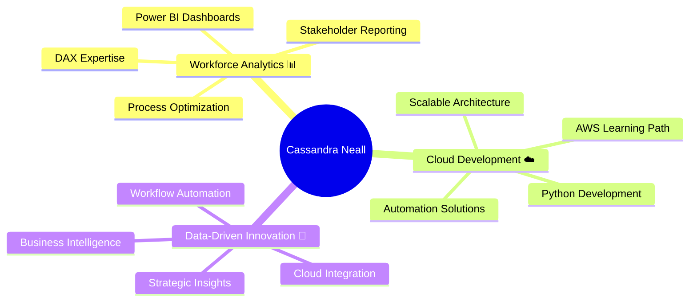

# 🌟 Cassandra Neall
### 📊 Workforce Analyst × ☁️ Aspiring Cloud Developer × 📈 Data Storyteller
*Transforming workforce insights into scalable cloud solutions*

---

## 🛠️ Tech Arsenal

### 💻 Data & Analytics Powerhouse

### 🚀 Cloud Development Journey

---

## 📊 GitHub Analytics

<table>
<tr>
<td width="50%">

</td>
<td width="50%">

</td>
</tr>
</table>

### 🏆 GitHub Trophies

---

## 🌟 Professional Journey

---

## 🎯 Current Focus Areas

### 📈 Workforce Analytics Excellence
🔸 **Advanced Power BI Development** - Creating comprehensive dashboards that transform raw workforce data into strategic insights  
🔸 **DAX Mastery** - Building complex calculations and measures for sophisticated reporting  
🔸 **Process Automation** - Streamlining analytical workflows with Power Automate  

### ☁️ Cloud Development Transition  
🔸 **AWS Fundamentals** - Building foundational knowledge in cloud architecture and services  
🔸 **Python for Cloud** - Developing programming skills focused on cloud applications  
🔸 **Scalable Solutions** - Learning to architect systems that grow with business needs  

### 🔄 Integration & Innovation
🔸 **Data Pipeline Development** - Connecting analytics expertise with modern development practices  
🔸 **Business Intelligence Evolution** - Bridging traditional BI with cloud-native solutions  
🔸 **Strategic Problem Solving** - Applying analytical thinking to technical challenges  

---

## 🚀 Featured Projects & Achievements

| 🏆 **Analytics Excellence** | ☁️ **Development Growth** | 🔧 **Innovation Lab** |
|:---:|:---:|:---:|
| Comprehensive workforce dashboards | AWS cloud learning projects | Interactive web applications |
| Advanced DAX formulations | Python automation scripts | Process optimization tools |
| Stakeholder reporting systems | Cloud architecture studies | Creative coding solutions |

---

## 📊 Skills Progression

**Workforce Analytics** `████████████████████` 95%  
**Power BI & DAX** `███████████████████` 90%  
**Data Visualization** `██████████████████` 85%  
**Process Automation** `█████████████████` 80%  
**Python Development** `████████████` 60%  
**AWS Cloud Services** `███████` 35%  
**Git & Version Control** `██████████` 50%  

---

## 💫 Professional Vision

**Current Role:** Workforce Analyst leveraging data to drive organizational insights and efficiency

**Transition Goal:** Cloud Developer who brings analytical rigor to scalable solution development  

**Unique Value:** Combining deep workforce analytics expertise with modern cloud development skills to build solutions that truly understand business needs

**Next Steps:** Expanding AWS knowledge while continuing to deliver high-impact analytical solutions

---

## 🌈 Recent Activity

---

## 🎨 Connect & Collaborate

**Let's discuss:** Data analytics • Cloud development • Automation solutions • Career transitions

---

### ✨ *"Where analytical expertise meets cloud innovation"* ✨

*Building tomorrow's solutions with today's insights*

