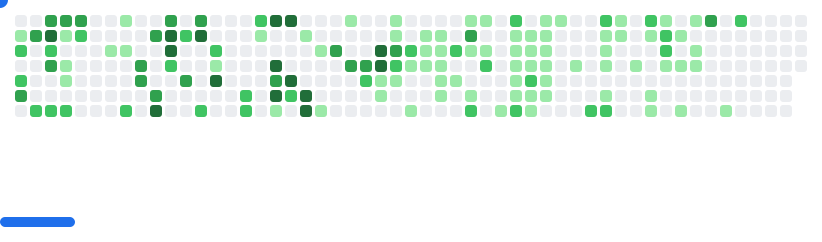

# 🌸 Cassandra Neall 🌸
### 📊 Workforce Analyst  × 📈 Data Storyteller × ☁️ Aspiring Cloud Developer
*Transforming workforce insights into data-driven solutions*

---

## 🛠️ Tech Arsenal

### 💻 Data & Analytics Powerhouse

### 🚀 Cloud Development Journey

---

## 📊 GitHub Analytics

<picture>
  <source media="(prefers-color-scheme: dark)" srcset="images/breakout-dark.svg" />
  <source media="(prefers-color-scheme: light)" srcset="images/breakout-light.svg" />
  
</picture>

---

## 🎯 Current Focus Areas

### 📈 Workforce Analytics Excellence
🔹 **Advanced Power BI Development** - Creating comprehensive dashboards that transform raw workforce data into strategic insights  
🔹 **DAX Mastery** - Building complex calculations and measures for sophisticated reporting  
🔹 **Process Automation** - Streamlining analytical workflows with Power Automate  

### ☁️ Cloud Development Transition  
🔹 **AWS Fundamentals** - Building foundational knowledge in cloud architecture and services  
🔹 **Python for Cloud** - Developing programming skills focused on cloud applications  
🔹 **Scalable Solutions** - Learning to architect systems that grow with business needs  

### 🔄 Integration & Innovation
🔹 **Data Pipeline Development** - Connecting analytics expertise with modern development practices  
🔹 **Business Intelligence Evolution** - Bridging traditional BI with cloud-native solutions  
🔹 **Strategic Problem Solving** - Applying analytical thinking to technical challenges  

---

## 💫 Professional Vision

**Current Role:** Workforce Analyst leveraging data to drive organizational insights and efficiency

**Transition Goal:** Cloud Developer who brings analytical rigor to scalable solution development  

**Unique Value:** Combining deep workforce analytics expertise with modern cloud development skills to build solutions that truly understand business needs

**Next Steps:** Expanding AWS knowledge while continuing to deliver high-impact analytical solutions

---

## 🗣️ Connect & Collaborate

**Let's discuss:** Data analytics • Cloud development • Automation solutions • Career transitions

