# 🌸 Cassandra Neall 🌸
### 📊 Workforce Analyst → ☁️ Cloud Developer | Data Wizard & Code Enthusiast
*Where analytical rigor meets creative problem-solving*

---

## 🦋 About This Eccentric Analyst

I'm a workforce analyst who decided that spreadsheets and dashboards, while amazing, aren't quite enough to contain my ambitions! Currently on an exciting journey from data analysis to cloud development, because why not combine the best of both worlds?

**My Vibe:** Professional expertise meets creative chaos. I believe the most innovative solutions come from thinking outside conventional boundaries while maintaining analytical rigor.

**The Journey:** Workforce Analytics → Cloud Development → Building systems that actually make people's work lives better (with style!)

---

## 🛠️ My Magical Tech Arsenal

### 💜 Current Superpowers

### 🌟 Growing Powers

---

## 🎮 Fun Stuff That Shows My Skills Too

<picture>
  <source media="(prefers-color-scheme: dark)" srcset="images/breakout-dark.svg" />
  <source media="(prefers-color-scheme: light)" srcset="images/breakout-light.svg" />
  
</picture>

*Yes, I built a game! It's not just for fun - it showcases DOM manipulation, event handling, and game logic. Professional skills, playful presentation! 🎯*

---

## 📊 GitHub Analytics (The Pretty Numbers)

<table>
<tr>
<td width="50%">

</td>
<td width="50%">

</td>
</tr>
</table>

### 🏆 Achievement Unlocked!

---

## 🌈 Professional Journey (The Serious Stuff)

```mermaid
mindmap
  root((Cassandra))
    Workforce Analytics 📊
      Power BI Mastery
      Process Optimization  
      Stakeholder Communication
      Data-Driven Insights
    Cloud Development ☁️
      AWS Learning Journey
      Python Development
      Scalable Solutions
      Modern Architecture
    The Sweet Spot 🎯
      Analytics-Informed Development
      Business Problem Solving
      Creative Technical Solutions
      User-Centered Design
```

### 🎯 What Makes Me Different

**Analytical Rigor + Creative Problem Solving:** I don't just build things - I build things that solve real problems, backed by data and delivered with flair.

**Business Context Awareness:** Years in workforce analytics means I understand how technology impacts actual humans at work (and I care about making their lives better).

**Eccentric Approach:** I believe the best solutions come from thinking differently. Professional doesn't mean boring!

---

## 🚀 Current Adventures

🌟 **Workforce Intelligence Platform** - Building comprehensive dashboards that turn workforce data into strategic insights

☁️ **Cloud Migration Project** - Learning AWS while building scalable solutions (because why learn small?)

🔄 **Automation Magic** - Creating Power Automate flows that eliminate soul-crushing repetitive tasks

🎨 **Portfolio Evolution** - Showcasing how analytical thinking enhances development work

---

## 💫 Professional Goals

**Now:** Master cloud development while leveraging my analytical superpowers to build solutions that actually matter

**Soon:** Architect enterprise-level systems that bridge the gap between business intelligence and modern development

**Eventually:** Be known as the developer who brings both analytical depth AND creative innovation to every project

**Always:** Keep learning, keep building, keep being authentically eccentric while delivering professional excellence

---

## 🌸 Let's Connect!

I love talking about the intersection of data, technology, and creative problem-solving. Whether you want to discuss DAX formulas, cloud architecture, or why I put flowers in my GitHub profile, I'm here for it!

💼 **Professional Mode:** [LinkedIn Profile]  
📧 **Collaboration Inquiries:** [Email]  
🌐 **Portfolio & Projects:** [Website]  
💬 **Casual Tech Chat:** Always open to interesting conversations!

---

### 🌟 *"Professional excellence with personality - because the best solutions come from humans who aren't afraid to be themselves"* 🌟

