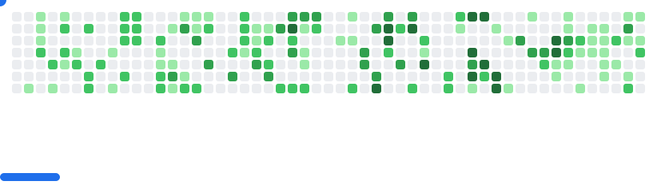

# 🌸 Cassandra Neall 🌸
### 📊 Workforce Analyst  × 📈 Data Storyteller × 📊 Aspiring Data Analyst
*Transforming workforce insights into data-driven solutions*

---

## 🛠️ Tech Arsenal

### 💻 Data & Analytics Powerhouse

### 🚀 Advanced Analytics Journey

---

## 📊 GitHub Analytics

<picture>
  <source media="(prefers-color-scheme: dark)" srcset="images/breakout-dark.svg" />
  <source media="(prefers-color-scheme: light)" srcset="images/breakout-light.svg" />
  
</picture>

---

## 🎯 Current Focus Areas

### 📈 Workforce Analytics Excellence
🔹 **Advanced Power BI Development** - Creating comprehensive dashboards that transform raw workforce data into strategic insights  
🔹 **DAX Mastery** - Building complex calculations and measures for sophisticated reporting  
🔹 **Process Automation** - Streamlining analytical workflows with Power Automate  

### 📊 Advanced Data Analytics Transition  
🔹 **Statistical Analysis** - Deepening expertise in statistical methods and hypothesis testing  
🔹 **SQL & Python Mastery** - Developing programming skills for data manipulation, analysis, and automation  
🔹 **Predictive Modeling** - Building analytical models to forecast trends and behaviors  

### 🔄 Integration & Innovation
🔹 **Data Pipeline Development** - Connecting analytics expertise with modern data processing techniques  
🔹 **Business Intelligence Evolution** - Bridging traditional BI with advanced analytical capabilities  
🔹 **Strategic Problem Solving** - Applying analytical thinking to complex data challenges  

---

## 💫 Professional Vision

**Current Role:** Workforce Analyst leveraging data to drive organizational insights and efficiency

**Transition Goal:** Data Analyst who combines domain expertise with advanced analytical methodologies  

**Unique Value:** Blending deep workforce analytics experience with modern data science techniques to uncover actionable insights

**Next Steps:** Expanding statistical analysis and predictive modeling skills while continuing to deliver high-impact analytical solutions

---

## 🗣️ Connect & Collaborate

)

**Let's discuss:** Data analytics • Statistical analysis • Predictive modeling • Career transitions

